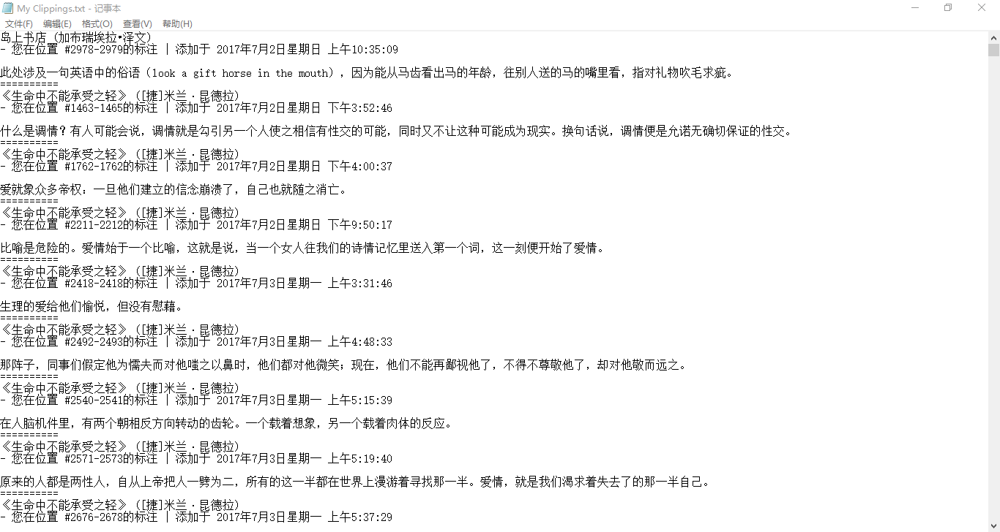
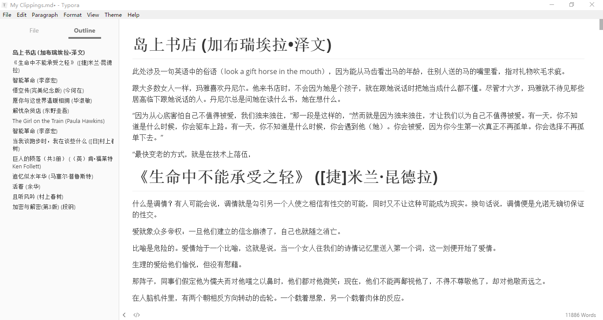

# Kindle Clippings To Markdown

> For Daily Reading
>
> For Daily Learning
>
> Know More
>
> Get Better 

> Kindle Clippings To Markdown.py My Clippings.txt

You will get a markdown file named “My Clippings.txt“  In the current folder.

